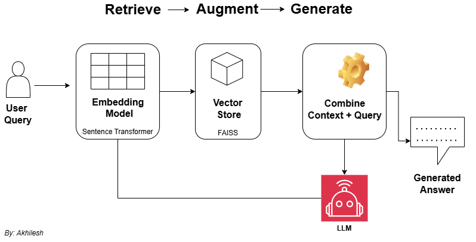

# 🧠 My First RAG System — From Scratch
> Built my own **Retrieval Augmented Generation (RAG)** system using open-source tools, no APIs, no black boxes, 100% free.

[](https://colab.research.google.com/github/<Akhilesh-Banke>/Basic_rag/blob/main/First_RAG.ipynb)


---

##  Overview

Modern Large Language Models (LLMs) like GPT and T5 are powerful  but they *hallucinate*.  
If we ask them about any company policy or a custom document, and they might invent a convincing but wrong answer.

**Retrieval Augmented Generation (RAG)** fixes that.  
It gives the model an *open-book exam*: before answering, it retrieves real context from the data, then generates the answer only from that context.

In this project, I’ll build a **RAG pipeline from scratch** with no external APIs, no databases but yeah using:

| Component | Library | Purpose |
|------------|----------|----------|
| **LLM** | `transformers` (Google FLAN-T5) | Generates answers |
| **Embeddings** | `sentence-transformers` | Converts text → vectors |
| **Vector DB** | `faiss-cpu` | Fast similarity search |
| **Text Splitter** | `langchain` | Smart chunking of text |

---

##  RAG Architecture

<p align="center">
  
</p>

> **Retrieve → Augment → Generate**
>
> 1️⃣ *Retrieve:* Find relevant chunks using FAISS  
> 2️⃣ *Augment:* Combine them with the user’s query  
> 3️⃣ *Generate:* Produce a grounded answer using FLAN-T5  

---

##  Features

✅ 100% local — no API calls  
✅ No hallucinations (answers only from context)  
✅ Lightweight & free models  
✅ Modular Python class for re-use  
✅ Notebook demo + CLI interaction  
✅ Easy to extend (PDFs, multi-doc, Streamlit UI)

---

##  Installation

Clone my repository:

```bash
git clone https://github.com/Akhilesh-Banke/Basic_RAG.git

